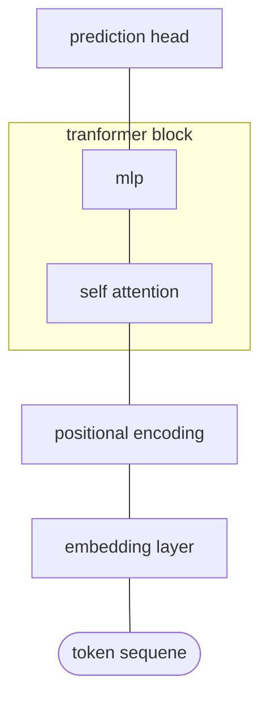

The is the result of my learning results of Karpathy's from zero to hero courses.

# gpt2
** plan **
1. write a doc to explain gpt2 and my training process
2. describe how it is evaluated
3. compare it with OpenAI's gpt2, gpt3, and gpt4

# transformer

- attention

$$softmax(\frac{K \times Q^T}{\sqrt{d_{head}}})\times V$$

- architecture

